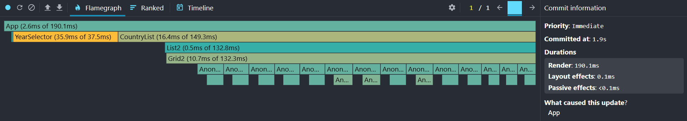
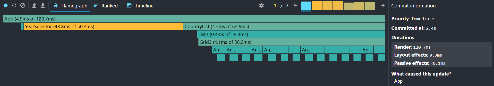
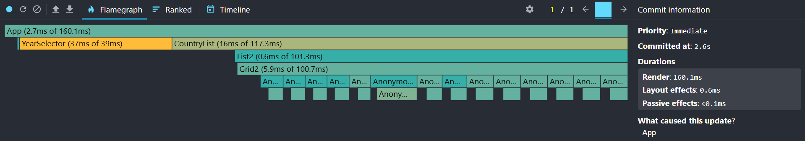
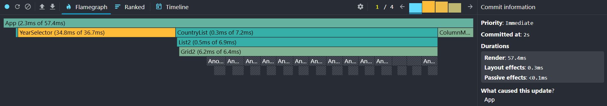

# Performance Optimization Report

## Baseline Measurements

### Interaction A: Sort countries

- **Commit duration**: N/A
- **Render duration**: 1032.2 ms
- **Screenshot**: 

### Interaction B: Search countries

- **Commit duration**: N/A
- **Render duration**: 548.4 ms
- **Screenshot**: 

### Interaction C: Change year

- **Commit duration**: N/A
- **Render duration**: 1102.0 ms
- **Screenshot**: 

### Interaction D: Toggle column

- **Commit duration**: N/A
- **Render duration**: 887.5 ms
- **Screenshot**: 

## Optimized Measurements

### Interaction A: Sort countries

- **Commit duration**: N/A
- **Render duration**: 190.1 ms
- **Screenshot**: 

### Interaction B: Search countries

- **Commit duration**: N/A
- **Render duration**: 120.7 ms
- **Screenshot**: 

### Interaction C: Change year

- **Commit duration**: N/A
- **Render duration**: 160.1 ms
- **Screenshot**: 

### Interaction D: Toggle column

- **Commit duration**: N/A
- **Render duration**: 57.4 ms
- **Screenshot**: 

## Summary of Improvements

| Interaction      | Baseline (ms) | Optimized (ms) | Improvement |
| ---------------- | ------------- | -------------- | ----------- |
| Sort countries   | 1032.2        | 190.1          | 82%         |
| Search countries | 548.4         | 120.7          | 78%         |
| Change year      | 1102.0        | 160.1          | 86%         |
| Toggle column    | 887.5         | 57.4           | 94%         |
| **Average**      | **892.5**     | **132.1**      | **85%**     |
